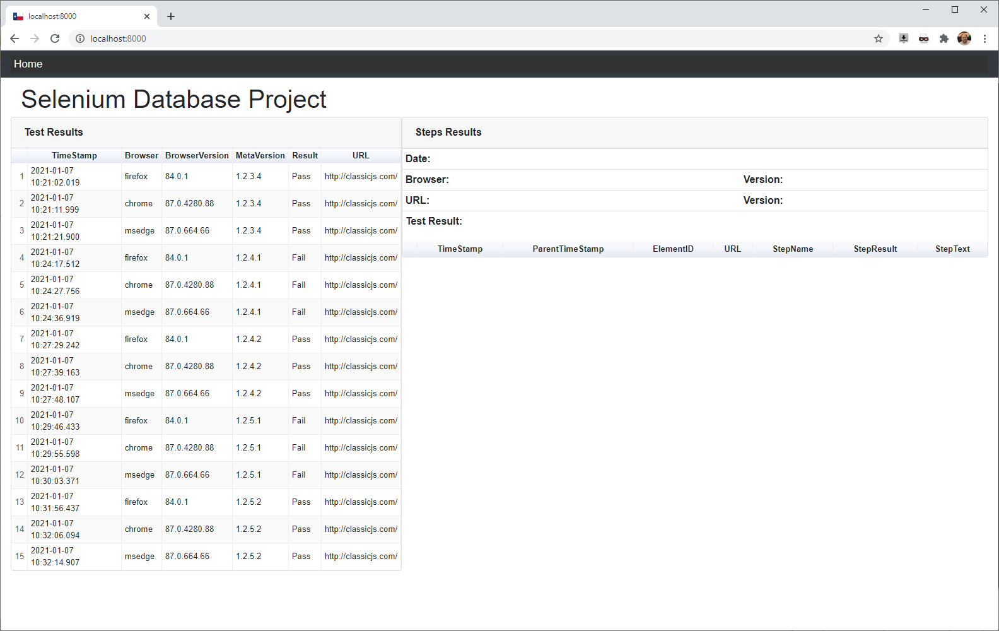
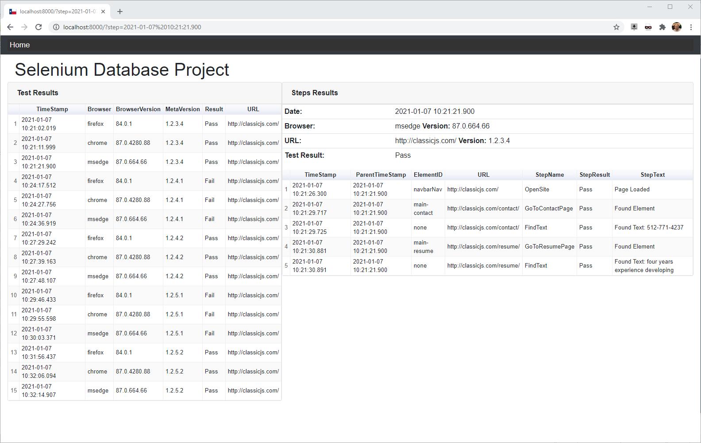
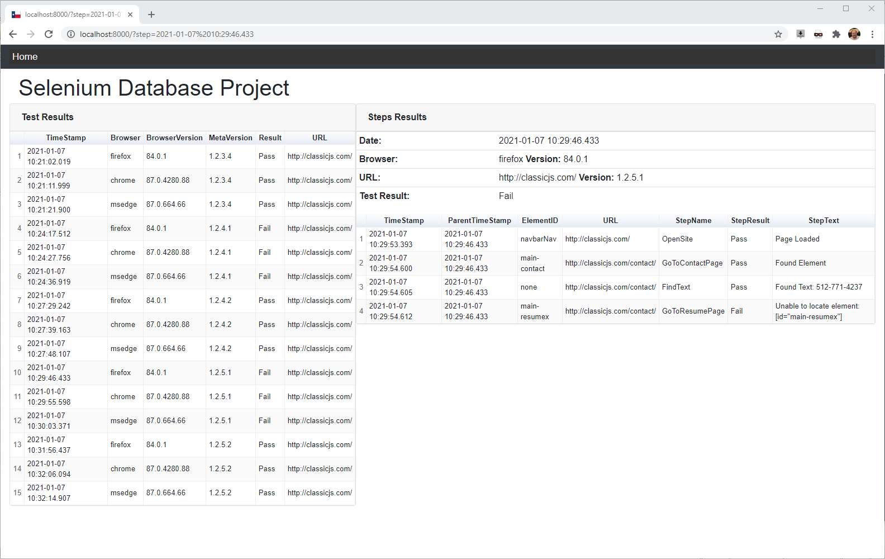

# Selenium Database Project

<!-- TABLE OF CONTENTS -->
<details open>
  <summary>Table of Contents</summary>
  <ol>
    <li><a href="#about-the-project">About The Project</a></li>
    <li><a href="#tech-stack">Tech Stack</a></li>
    <li><a href="#the-database">The Database</a></li>
  </ol>
</details>

<!-- ABOUT THE PROJECT -->
## About The Project
This project is demonstrates a way to record Selenium test results to a MySQL database.<br>
And display the Selenium test results in a web page.<br>
This allows anyone with access to the site to monitor test progress and results.<br>
Test results are immediately available to managers/developers.<br>
The information is stored in a remote MySQL database on a RaspberryPI.<br>
The data retrieved from the database is displayed as a table using Google Charts.<br>
The left side table shows a list of all the test that were ran.<br>
The right side table shows a list of all the test steps that were ran for a test.<br>
Clicking on a row on the left side table will show all the test steps for that test in the right side table.<br>







<!-- TECH STACK -->
## Tech Stack
The major frameworks used to develop this project
* [Django](https://www.djangoproject.com/), Version:2.2.17
* [Python](https://www.python.org/), Version: 3.8.7
* [MySQL](https://www.mysql.com/), Version: 10.1.38-MariaDB
* [Selenium WebDriver](https://www.selenium.dev/), Version: 3.141.0

<!-- THE DATABASE -->
## The Database
The database is installed on a RaspberryPI which is configured as the database server.<br>
The test_result table is a list of all tests that were executed.<br>
The step_result table is a list of all the test steps ran for each test_result.<br>

```sql
CREATE DATABASE `sedb` DEFAULT CHARACTER SET utf8mb4;

USE `sedb`;

CREATE TABLE `test_result` (
  `ID` int NOT NULL AUTO_INCREMENT,
  `TimeStamp` DATETIME(3) DEFAULT 0,
  `Browser` char(32) NOT NULL DEFAULT '',
  `BrowserVersion` char(32) NOT NULL DEFAULT '',
  `MetaVersion` char(32) NOT NULL DEFAULT '',
  `Result` char(32) NOT NULL DEFAULT '',
  `URL` char(32) NOT NULL DEFAULT '',
  PRIMARY KEY (`ID`)
) ENGINE=InnoDB DEFAULT CHARSET=utf8mb4;

CREATE TABLE `step_result` (
  `ID` int NOT NULL AUTO_INCREMENT,
  `TimeStamp` DATETIME(3) DEFAULT 0,
  `ParentTimeStamp` DATETIME(3) DEFAULT 0,
  `ElementID` char(32) NOT NULL DEFAULT '',
  `URL` char(32) NOT NULL DEFAULT '',
  `StepName` char(32) NOT NULL DEFAULT '',
  `StepResult` char(32) NOT NULL DEFAULT '',
  `StepText` varchar(256) NOT NULL DEFAULT '',
  PRIMARY KEY (`ID`)
) ENGINE=InnoDB DEFAULT CHARSET=utf8mb4;
```